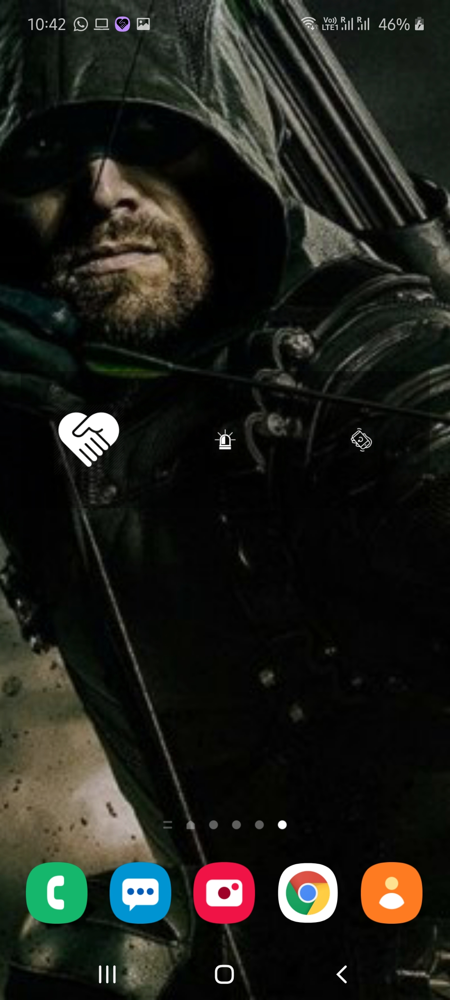

# helpful-sense

## Features

Android app which can send SMS with current location to trusted contacts by simple gestures like shaking the phone or pressing single button. This app can prove useful for women travelling alone at night for their safety to keep their family/trusted friends alerted.

## Outputs

| | | |
|:-------------------------:|:-------------------------:|:-------------------------:|
 Add quick actions for sending frequent urgent messages with current location on one tap |  Send custom SMS with current location |
 Select trusted contacts to notify them in case of emergency |  SMS received from someone who has set you as trusted contact with their current location |
 Customize your preferences as per your requirement |  Quick action widget on home screen |
